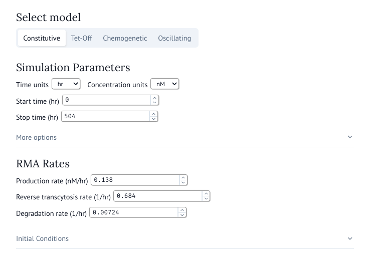
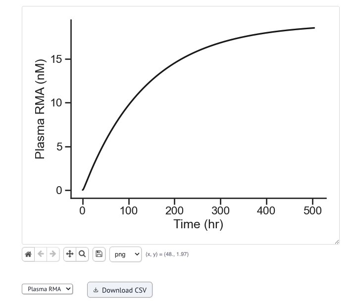

# Web Application Guide

A simple web based app is available for quick testing. Note that this version
is built with Python and uses Marimo (the same tool used to run analysis notebooks)
and can be slow for large simulations or moderate to large amounts of network traffic.
In those cases, we recommend using the Python library directly.

## Getting Started

The current version is hosted on Railway and is available [here](https://rma-kinetics.up.railway.app/).
To get started, simply navigate to the link in your preferred browser. Their may
be a small loading time to wake up the service and allow for any packages to be
reinstalled and cached if needed.

### Choosing a model

Once the page has loaded, you can select the model you would like to run
in the selection tabs. As you click through the model selection tabs, the available
parameters for that model will be displayed. In some cases, their are additional
parameters that can be adjusted by clicking the `More options` button.

### Running Simulations

Update these parameters as needed and use the `Run Simulation` button to submit
a job.

For the more complex models, you might experience a delay as the solver is running.
You should see a loading icon if a simulation is running and results will automatically
display when finished.

### Inspecting Results

Results will automatically be displayed when availble. By default, the plasma RMA
solution will be plotted. Below the plot, are options for inspecting or saving the image.
You can use image format selection tool to change the type of image file that will be saved.
To save an image, use the `Save` button just next to the image type selector.

Below the plot tools, you can find the species selector where you can select a
different availble species to view on the plot. The `Download CSV` button to the
right will prompt to save a csv file with the data from the simulation.

## Help

For any additional help, bug reporting, or feedback, please submit an [issue](https://github.com/szablowskilab/rma-kinetics/issues/new).
